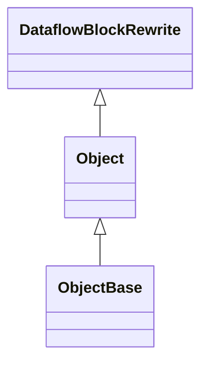

本文以`TVM v0.20.0`为例，分析TVM中Python前端与C++后端的绑定机制。绑定机制主要包括三个部分：**类的注册**、**对象的初始化**以及**成员函数的绑定**。本文将以`DataflowBlockRewrite`类为例，逐步解析这一过程。

<!-- more -->

> 为行文方便，前端默认指TVM python前端，后端默认指TVM C++后端

### 一、前端注册类

在TVM前端中，需要对每一个类进行注册。

以`DataflowBlockRewrite`为例，注册代码如下

```python
@tvm._ffi.register_object("relax.DataflowBlockRewrite")
class DataflowBlockRewrite(Object):
    ......
#等价于DataflowBlockRewrite = tvm._ffi.register_object("relax.DataflowBlockRewrite")(DataflowBlockRewrite)
```

> 为了行文流畅，本文中大多数的类、文件没有注明具体路径，读者可以使用VSCode `Ctrl + P`搜索文件，侧边栏搜索类名进行检索。

接下来，我们分析`tvm._ffi.register_object`的执行流程，该函数定义如下：

```python
def register_object(type_key=None):
    
    object_name = type_key if isinstance(type_key, str) else type_key.__name__ #object_name = "relax.DataflowBlockRewrite"

    def register(cls):
        #ignore ....

    if isinstance(type_key, str):
        return register

    return register(type_key)
```

当传入字符串参数`"relax.DataflowBlockRewrite"` 时， `tvm._ffi.register_object("relax.DataflowBlockRewrite")`返回一个注册函数`register`。

再看`register(DataflowBlockRewrite)`

```python
def register(cls):
        """internal register function"""
        if hasattr(cls, "_type_index"):
            tindex = cls._type_index
        else:
            # tidx是一个与C uint兼容的uint数据类型
            tidx = ctypes.c_uint()
            if not _RUNTIME_ONLY:
                check_call(_LIB.TVMObjectTypeKey2Index(c_str(object_name), ctypes.byref(tidx)))#检查这个类是否在C++后端中,如果存在，将type_index写入tidx(=240)
            else:
                # directly skip unknown objects during runtime.
                ret = _LIB.TVMObjectTypeKey2Index(c_str(object_name), ctypes.byref(tidx))
                if ret != 0:
                    return cls
            tindex = tidx.value#tindex = 240
        #注册
        _register_object(tindex, cls)
        return cls
```


函数 `_register_object`的定义在`object.pxi`中，以`_register_object(240, DataflowBlockRewrite)`的执行流程为例：

> **Cython编译流程**：
>
> `python/tvm/_ffi/_cython`中`base.pxi`,`ndarray.pxi`,`object.pxi`,`packed_func.pxi`描述了与C++的接口，`core.pyx` `include`了这些`*.pxi`文件。
>
> TVM项目编译后，`python/tvm/_ffi/_cython`中的`core.pyx`被编译成 `python/tvm/_ffi/_cy3`中的`.so`文件(例如`core.cpython-312-x86_64-linux-gnu.so`)。(Cython具体编译配置见`python/setup.py`L161)。完成编译后，便可以在`python`文件中调用`.so`中的C++函数/类。例如`python/tvm/_ffi/registry.py`中`from ._cy3.core import _register_object`

```python
"""Maps object type index to its constructor"""
cdef list OBJECT_TYPE = []
"""Maps object type to its type index"""
cdef dict OBJECT_INDEX = {}

#object是python内置的一个类，可表示所有对象
def _register_object(int index, object cls):
    """register object class"""
    if issubclass(cls, NDArrayBase):
        _register_ndarray(index, cls)
        return

    global OBJECT_TYPE
    while len(OBJECT_TYPE) <= index:
        OBJECT_TYPE.append(None)
      
    #将类写进列表、字典中，从而实现注册
    OBJECT_TYPE[index] = cls  # ID → Python类
    OBJECT_INDEX[cls] = index # Python类 → ID
```

* 前端和后端中相对应的类的`type_index`相等，从而实现一一对应。

### 二、前端对象初始化

仍然以`DataflowBlockRewrite`为例

```python
@tvm._ffi.register_object("relax.DataflowBlockRewrite")
class DataflowBlockRewrite(Object):
    def __init__(self, dfb: DataflowBlock, root_fn: Function):
        self.func_name = root_fn.__name__ if hasattr(root_fn, "__name__") else None
        self.__init_handle_by_constructor__(
            _ffi_api.DataflowBlockRewrite, dfb, root_fn  # type: ignore
        )
    
```

`DataflowBlockRewrite`前端初始化函数`__init__`所需的参数与后端C++构造函数一致。 `binding_rewrite.h`：

```cpp
class DataflowBlockRewrite : public ObjectRef {
 public:
  TVM_DLL explicit DataflowBlockRewrite(DataflowBlock dfb, Function root_fn);
```

python对象初始化时，通过`self.__init_handle_by_constructor__`创建了C++实例。

`object.pxi`中定义了类`ObjectBase`和方法`__init_handle_by_constructor__`: 

```cython
cdef class ObjectBase
	cdef void* chandle
	def __init_handle_by_constructor__(self, fconstructor, *args):
        
        self.chandle = NULL
        cdef void* chandle
        ConstructorCall(
            (<PackedFuncBase>fconstructor).chandle,
            kTVMObjectHandle, args, &chandle)
        self.chandle = chandle
```

类的初始化发生在函数`ConstructorCall`。此处函数调用栈比较深，可以简单理解为：使用构造函数`fconstructor`和参数`args`，构造了一个`C++`的`DataflowBlockRewrite`类，并用临时指针`chandle`指向这个`C++`实例，再用`self.chandle`指向该C++实例。


`DataflowBlockRewrite`继承自`ObjectBase`：



因此，python类`DataflowBlockRewrite`有一个成员变量`self.chandle`指向C++对象`DataflowBlockRewrite`,即python DataflowBlockRewrite.chandle  ->  &(C++ DataflowBlockRewrite)，从而实现了python对象与C++对象的绑定。


### 三、TVM前端对象的成员函数与后端对象的成员函数绑定

仍然以`DataflowBlockRewrite`为例，它的`replace_all_uses`方法与后端C++函数`ReplaceAllUses`进行了绑定：

```python
@tvm._ffi.register_object("relax.DataflowBlockRewrite")
class DataflowBlockRewrite(Object):
def replace_all_uses(self, old_var: Var, new_var: Var) -> None:
        _ffi_api.dfb_rewrite_replace_all_uses(self, old_var, new_var) 
```

```cpp
/*! \brief Statement rewriter for relax.DataflowBlock. */
class DataflowBlockRewriteNode : public Object {
 public:
  /*! \brief Replace all uses of old_var with new_var. */
  void ReplaceAllUses(Var old_var, Var new_var);
```

python类`DataflowBlockRewrite`调用`_ffi_api.dfb_rewrite_replace_all_uses`，实际在调用后端的注册函数`relax.dfb_rewrite_replace_all_uses`：

```cpp
TVM_REGISTER_GLOBAL("relax.dfb_rewrite_replace_all_uses")
    .set_body_typed([](DataflowBlockRewrite rwt, Var old_var, Var new_var) {
      rwt->ReplaceAllUses(old_var, new_var);
    });
```

函数体内再调用`rwt->ReplaceAllUses(old_var, new_var);`


所以，`_ffi_api.dfb_rewrite_replace_all_uses`是如何与后端注册的函数`relax.dfb_rewrite_replace_all_uses`进行绑定的呢？`_ffi_api`是一个module，为什么会有一个`dfb_rewrite_replace_all_uses`方法呢？这一功能的实现依赖于Python一个特性，运行时对象属性更新(Dynamic Attribute Assignment).

在`binging_rewrite.py`中，通过`from . import _ffi_api`导入`_ffi_api`，这个导入操作会执行`_ffi_api.py`中的`tvm._ffi._init_api("relax", __name__)`，这行代码将后端注册的、`relax namspace`中的函数写入了`_ffi_api`这个module。


```shell
tvm._ffi._init_api("relax", __name__)
# __name__ = tvm.relax._ffi_api
# __name__是python内置的一个变量，表示当前python文件被调用时的路径
```

`registry.py`

```python
def _init_api(namespace, target_module_name=None):
    #namespace = "relax", target_module_name = "tvm.relax._ffi_api"
    target_module_name = target_module_name if target_module_name else namespace
    if namespace.startswith("tvm."):
        _init_api_prefix(target_module_name, namespace[4:])
    else:
        # target_module_name = "tvm.relax._ffi_api", namespace = "relax"
        _init_api_prefix(target_module_name, namespace)

        
        
def _init_api_prefix(module_name, prefix):
    # module_name = "tvm.relax._ffi_api", prefix = "relax"
    # sys.modules是python内置的字典，可以通过名称来获取module
    module = sys.modules[module_name] #module = _ffi_api

    for name in list_global_func_names():#列出后端注册的所有函数
        if not name.startswith(prefix):
            continue
		#以name = "relax.dfb_rewrite_replace_all_uses"为例
        fname = name[len(prefix) + 1 :]#name = dfb_rewrite_replace_all_uses
        target_module = module #_ffi_api

        if fname.find(".") != -1:
            continue
        #拿到dfb_rewrite_replace_all_uses的C++ handle
        f = get_global_func(name)
        #wrap it as a python function
        ff = _get_api(f)
        ff.__name__ = fname#设置名字为dfb_rewrite_replace_all_uses
        ff.__doc__ = "TVM PackedFunc %s. " % fname
        
        #为模块(对象)_ffi_api设置一个属性
        #等价于_ffi_api."dfb_rewrite_replace_all_uses" = ff
        setattr(target_module, ff.__name__, ff)
```

`Tips`: 

* 后端`relax.dfb_rewrite_replace_all_uses`的注册

```cpp
TVM_REGISTER_GLOBAL("relax.dfb_rewrite_replace_all_uses")
    .set_body_typed([](DataflowBlockRewrite rwt, Var old_var, Var new_var) {
      rwt->ReplaceAllUses(old_var, new_var);
    });
```

`list_global_func_names()`返回的列表中有一个字符串为`relax.dfb_rewrite_replace_all_uses`

* 经过以上步骤，`_ffi_api`具有属性`dfb_rewrite_replace_all_uses`, `_ffi_api.dfb_rewrite_replace_all_uses`是一个python函数`dfb_rewrite_replace_all_uses`, 它里面包装了对应的名为`relax.dfb_rewrite_replace_all_uses`的后端注册的函数。