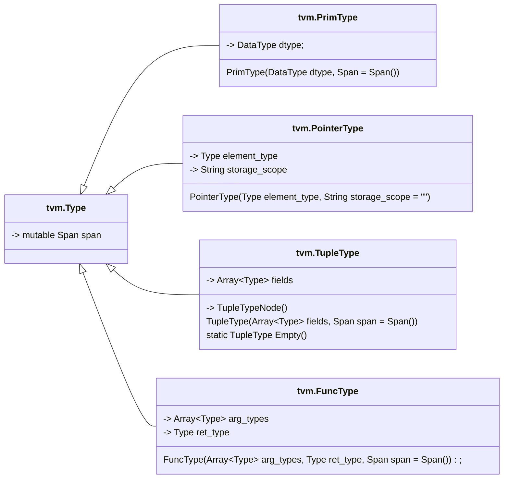
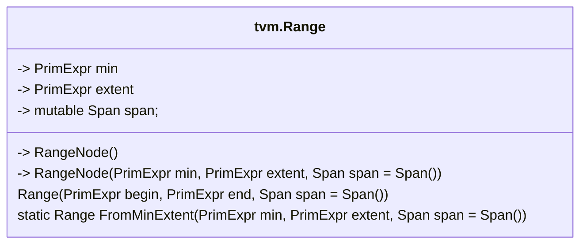

## Class Reference

### 1. tvm::BaseExpr

```mermaid
classDiagram
    direction LR

    tvm.BaseExpr <|-- tvm.RelaxExpr
    tvm.BaseExpr <|-- tvm.PrimExpr

    tvm.RelaxExpr <|-- tvm.GlobalVar
    tvm.RelaxExpr <|-- tvm.BaseFunc
    tvm.RelaxExpr <|-- tvm.Op
    tvm.RelaxExpr <|-- tvm.relax.Call
    tvm.RelaxExpr <|-- tvm.relax.If
    tvm.RelaxExpr <|-- tvm.relax.LeafExpr
    tvm.RelaxExpr <|-- tvm.relax.SeqExpr
    tvm.RelaxExpr <|-- tvm.relax.Tuple
    tvm.RelaxExpr <|-- tvm.relax.TupleGetItem

    tvm.BaseFunc <|-- tvm.relax.Function
    tvm.BaseFunc <|-- tvm.relax.ExternFunc
    tvm.BaseFunc <|-- tvm.tir.PrimFunc

    tvm.relax.LeafExpr <|-- tvm.relax.Constant
    tvm.relax.LeafExpr <|-- tvm.relax.DataTypeImm
    tvm.relax.LeafExpr <|-- tvm.relax.PrimValue
    tvm.relax.LeafExpr <|-- tvm.relax.ShapeExpr
    tvm.relax.LeafExpr <|-- tvm.relax.StringImm
    tvm.relax.LeafExpr <|-- tvm.relax.Var

    tvm.relax.Var <|-- tvm.relax.DataflowVar

    tvm.PrimExpr <|-- tvm.FloatImm
    tvm.PrimExpr <|-- tvm.IntImm
    tvm.PrimExpr <|-- tvm.arith.IterMapExpr
    tvm.PrimExpr <|-- tvm.tir.Add
    tvm.PrimExpr <|-- tvm.tir.And
    tvm.PrimExpr <|-- tvm.tir.Broadcast
    tvm.PrimExpr <|-- tvm.tir.BufferLoad
    tvm.PrimExpr <|-- tvm.tir.Call
    tvm.PrimExpr <|-- tvm.tir.Cast
    tvm.PrimExpr <|-- tvm.tir.Div
    tvm.PrimExpr <|-- tvm.tir.EQ
    tvm.PrimExpr <|-- tvm.tir.FloorDiv
    tvm.PrimExpr <|-- tvm.tir.FloorMod
    tvm.PrimExpr <|-- tvm.tir.GE
    tvm.PrimExpr <|-- tvm.tir.GT
    tvm.PrimExpr <|-- tvm.tir.LE
    tvm.PrimExpr <|-- tvm.tir.LT
    tvm.PrimExpr <|-- tvm.tir.Let
    tvm.PrimExpr <|-- tvm.tir.Max
    tvm.PrimExpr <|-- tvm.tir.Min
    tvm.PrimExpr <|-- tvm.tir.Mod
    tvm.PrimExpr <|-- tvm.tir.Mul
    tvm.PrimExpr <|-- tvm.tir.NE
    tvm.PrimExpr <|-- tvm.tir.Not
    tvm.PrimExpr <|-- tvm.tir.Or
    tvm.PrimExpr <|-- tvm.tir.ProducerLoad
    tvm.PrimExpr <|-- tvm.tir.Ramp
    tvm.PrimExpr <|-- tvm.tir.Reduce
    tvm.PrimExpr <|-- tvm.tir.Select
    tvm.PrimExpr <|-- tvm.tir.Shuffle
    tvm.PrimExpr <|-- tvm.tir.StringImm
    tvm.PrimExpr <|-- tvm.tir.Sub
    tvm.PrimExpr <|-- tvm.tir.Var

    tvm.IntImm <|-- tvm.Bool
    tvm.IntImm <|-- tvm.Integer

    tvm.arith.IterMapExpr <|-- tvm.arith.IterSplitExpr
    tvm.arith.IterMapExpr <|-- tvm.arith.IterSumExpr

    tvm.tir.Var <|-- tvm.tir.SizeVar

    class tvm.BaseExpr {
      -> mutable Span span
    }

    class tvm.PrimExpr {
      -> DataType dtype
      -> string Script(const Optional&ltPrinterConfig&gt& config = NullOpt)
      PrimExpr(int32_t value)
      PrimExpr(float value)
      DataType dtype()
    }

    note for tvm.PrimExpr "PrimExpr operator+(PrimExpr a, PrimExpr b)"
    note for tvm.PrimExpr "PrimExpr operator-(PrimExpr a, PrimExpr b)"
    note for tvm.PrimExpr "PrimExpr operator-(PrimExpr a)"
    note for tvm.PrimExpr "PrimExpr operator*(PrimExpr a, PrimExpr b)"
    note for tvm.PrimExpr "PrimExpr operator/(PrimExpr a, PrimExpr b)"
    note for tvm.PrimExpr "PrimExpr operator<<(PrimExpr a, PrimExpr b)"
    note for tvm.PrimExpr "PrimExpr operator>>(PrimExpr a, PrimExpr b)"
    note for tvm.PrimExpr "PrimExpr operator>(PrimExpr a, PrimExpr b)"
    note for tvm.PrimExpr "PrimExpr operator>=(PrimExpr a, PrimExpr b)"
    note for tvm.PrimExpr "PrimExpr operator<(PrimExpr a, PrimExpr b)"
    note for tvm.PrimExpr "PrimExpr operator<=(PrimExpr a, PrimExpr b)"
    note for tvm.PrimExpr "PrimExpr operator==(PrimExpr a, PrimExpr b)"
    note for tvm.PrimExpr "PrimExpr operator!=(PrimExpr a, PrimExpr b)"
    note for tvm.PrimExpr "PrimExpr operator&&(PrimExpr a, PrimExpr b)"
    note for tvm.PrimExpr "PrimExpr operator||(PrimExpr a, PrimExpr b)"
    note for tvm.PrimExpr "PrimExpr operator!(PrimExpr a)"
    note for tvm.PrimExpr "PrimExpr operator&(PrimExpr a, PrimExpr b)"
    note for tvm.PrimExpr "PrimExpr operator|(PrimExpr a, PrimExpr b)"
    note for tvm.PrimExpr "PrimExpr operator^(PrimExpr a, PrimExpr b)"
    note for tvm.PrimExpr "PrimExpr operator~(PrimExpr a)"

    class tvm.RelaxExpr {
        -> mutable Type checked_type_
        -> mutable Optional&ltObjectRef&gt struct_info_
        -> Type& checked_type()
        -> template &lttypename TTypeNode&gt TTypeNode* type_as()
    }

    class tvm.GlobalVar {
        -> String name_hint
        GlobalVar(String name_hint, Type type = Type(), Span span = Span())
    }

    class tvm.IntImm {
        -> int64_t value
        IntImm(DataType dtype, int64_t value, Span span = Span())
    }

    class tvm.FloatImm {
        -> double value
        FloatImm(DataType dtype, double value, Span span = Span())
    }

    class tvm.Bool {
        Bool(bool value, Span span = Span())
        Bool operator!()
        operator bool()
    }

    note for tvm.Bool "Bool operator||(const Bool& a, bool b)"
    note for tvm.Bool "Bool operator||(bool a, const Bool& b)"
    note for tvm.Bool "Bool operator&&(const Bool& a, const Bool &b)"
    note for tvm.Bool "Bool operator&&(const Bool& a, bool b)"
    note for tvm.Bool "Bool operator&&(bool a, const Bool& b)"
    note for tvm.Bool "Bool operator&&(const Bool& a, const Bool& b)"
    note for tvm.Bool "Bool operator==(const Bool& a, bool b)"
    note for tvm.Bool "Bool operator==(bool a, const Bool& b)"
    note for tvm.Bool "Bool operator==(const Bool& a, const Bool& b)"

    class tvm.Integer {
        Integer() 
        Integer(ObjectPtr<Object> node)
        Integer(int value, Span span = Span())
        Integer(IntImm other)
        template <typename Enum> Integer(Enum value)
        Integer& operator=(const IntImm& other)
        int64_t IntValue()
        Bool operator==(int other) 
        Bool operator!=(int other)
        template <typename Enum> Bool operator==(Enum other)
        template <typename Enum> Bool operator!=(Enum other)
    }
```

### 2. tvm::Type

```mermaid
classDiagram
    direction LR

    tvm.Type <|-- tvm.PrimType
    tvm.Type <|-- tvm.PointerType
    tvm.Type <|-- tvm.TupleType
    tvm.Type <|-- tvm.FuncType

    class tvm.Type {
      -> mutable Span span
    }

    class tvm.PrimType {
        -> DataType dtype;
        PrimType(DataType dtype, Span = Span())
    }
    class tvm.PointerType {
        -> Type element_type
        -> String storage_scope
        PointerType(Type element_type, String storage_scope = "")
    }
    class tvm.TupleType {
        -> Array&ltType&gt fields
        -> TupleTypeNode()
        TupleType(Array&ltType&gt fields, Span span = Span())
        static TupleType Empty()
    }
    class tvm.FuncType {
        -> Array&ltType&gt arg_types
        -> Type ret_type
        FuncType(Array&ltType&gt arg_types, Type ret_type, Span span = Span());
    }
```

### 3. tvm::Range

```mermaid
classDiagram
    direction LR

    class tvm.Range {
        -> PrimExpr min
        -> PrimExpr extent
        -> mutable Span span;
        -> RangeNode()
        -> RangeNode(PrimExpr min, PrimExpr extent, Span span = Span())
        Range(PrimExpr begin, PrimExpr end, Span span = Span())
        static Range FromMinExtent(PrimExpr min, PrimExpr extent, Span span = Span())
    }
```
