# TVM Reference

## Class Reference

### 1. tvm::BaseExpr

```mermaid
classDiagram
    direction LR

    tvm.BaseExpr <|-- tvm.RelaxExpr
    tvm.BaseExpr <|-- tvm.PrimExpr

    tvm.RelaxExpr <|-- tvm.GlobalVar
    tvm.RelaxExpr <|-- tvm.BaseFunc
    tvm.RelaxExpr <|-- tvm.Op
    tvm.RelaxExpr <|-- tvm.relax.Call
    tvm.RelaxExpr <|-- tvm.relax.If
    tvm.RelaxExpr <|-- tvm.relax.LeafExpr
    tvm.RelaxExpr <|-- tvm.relax.SeqExpr
    tvm.RelaxExpr <|-- tvm.relax.Tuple
    tvm.RelaxExpr <|-- tvm.relax.TupleGetItem

    tvm.BaseFunc <|-- tvm.relax.Function
    tvm.BaseFunc <|-- tvm.relax.ExternFunc
    tvm.BaseFunc <|-- tvm.tir.PrimFunc

    tvm.relax.LeafExpr <|-- tvm.relax.Constant
    tvm.relax.LeafExpr <|-- tvm.relax.DataTypeImm
    tvm.relax.LeafExpr <|-- tvm.relax.PrimValue
    tvm.relax.LeafExpr <|-- tvm.relax.ShapeExpr
    tvm.relax.LeafExpr <|-- tvm.relax.StringImm
    tvm.relax.LeafExpr <|-- tvm.relax.Var

    tvm.relax.Var <|-- tvm.relax.DataflowVar

    tvm.PrimExpr <|-- tvm.FloatImm
    tvm.PrimExpr <|-- tvm.IntImm
    tvm.PrimExpr <|-- tvm.arith.IterMapExpr
    tvm.PrimExpr <|-- tvm.tir.Add
    tvm.PrimExpr <|-- tvm.tir.And
    tvm.PrimExpr <|-- tvm.tir.BufferLoad
    tvm.PrimExpr <|-- tvm.tir.Call
    tvm.PrimExpr <|-- tvm.tir.Cast
    tvm.PrimExpr <|-- tvm.tir.Div
    tvm.PrimExpr <|-- tvm.tir.EQ
    tvm.PrimExpr <|-- tvm.tir.FloorDiv
    tvm.PrimExpr <|-- tvm.tir.FloorMod
    tvm.PrimExpr <|-- tvm.tir.GE
    tvm.PrimExpr <|-- tvm.tir.GT
    tvm.PrimExpr <|-- tvm.tir.LE
    tvm.PrimExpr <|-- tvm.tir.LT
    tvm.PrimExpr <|-- tvm.tir.Let
    tvm.PrimExpr <|-- tvm.tir.Max
    tvm.PrimExpr <|-- tvm.tir.Min
    tvm.PrimExpr <|-- tvm.tir.Mod
    tvm.PrimExpr <|-- tvm.tir.Mul
    tvm.PrimExpr <|-- tvm.tir.NE
    tvm.PrimExpr <|-- tvm.tir.Not
    tvm.PrimExpr <|-- tvm.tir.Or
    tvm.PrimExpr <|-- tvm.tir.ProducerLoad
    tvm.PrimExpr <|-- tvm.tir.Ramp
    tvm.PrimExpr <|-- tvm.tir.Broadcast
    tvm.PrimExpr <|-- tvm.tir.Shuffle
    tvm.PrimExpr <|-- tvm.tir.Reduce
    tvm.PrimExpr <|-- tvm.tir.Select
    tvm.PrimExpr <|-- tvm.tir.StringImm
    tvm.PrimExpr <|-- tvm.tir.Sub
    tvm.PrimExpr <|-- tvm.tir.Var

    tvm.IntImm <|-- tvm.Bool
    tvm.IntImm <|-- tvm.Integer

    tvm.arith.IterMapExpr <|-- tvm.arith.IterSplitExpr
    tvm.arith.IterMapExpr <|-- tvm.arith.IterSumExpr

    tvm.tir.Var <|-- tvm.tir.SizeVar

    class tvm.BaseExpr {
      -> mutable Span span
    }

    class tvm.PrimExpr {
      -> DataType dtype
      -> string Script(const Optional&ltPrinterConfig&gt& config = NullOpt)
      PrimExpr(int32_t value)
      PrimExpr(float value)
      DataType dtype()
    }

    note for tvm.PrimExpr "PrimExpr operator+(PrimExpr a, PrimExpr b)"
    note for tvm.PrimExpr "PrimExpr operator-(PrimExpr a, PrimExpr b)"
    note for tvm.PrimExpr "PrimExpr operator-(PrimExpr a)"
    note for tvm.PrimExpr "PrimExpr operator*(PrimExpr a, PrimExpr b)"
    note for tvm.PrimExpr "PrimExpr operator/(PrimExpr a, PrimExpr b)"
    note for tvm.PrimExpr "PrimExpr operator<<(PrimExpr a, PrimExpr b)"
    note for tvm.PrimExpr "PrimExpr operator>>(PrimExpr a, PrimExpr b)"
    note for tvm.PrimExpr "PrimExpr operator>(PrimExpr a, PrimExpr b)"
    note for tvm.PrimExpr "PrimExpr operator>=(PrimExpr a, PrimExpr b)"
    note for tvm.PrimExpr "PrimExpr operator<(PrimExpr a, PrimExpr b)"
    note for tvm.PrimExpr "PrimExpr operator<=(PrimExpr a, PrimExpr b)"
    note for tvm.PrimExpr "PrimExpr operator==(PrimExpr a, PrimExpr b)"
    note for tvm.PrimExpr "PrimExpr operator!=(PrimExpr a, PrimExpr b)"
    note for tvm.PrimExpr "PrimExpr operator&&(PrimExpr a, PrimExpr b)"
    note for tvm.PrimExpr "PrimExpr operator||(PrimExpr a, PrimExpr b)"
    note for tvm.PrimExpr "PrimExpr operator!(PrimExpr a)"
    note for tvm.PrimExpr "PrimExpr operator&(PrimExpr a, PrimExpr b)"
    note for tvm.PrimExpr "PrimExpr operator|(PrimExpr a, PrimExpr b)"
    note for tvm.PrimExpr "PrimExpr operator^(PrimExpr a, PrimExpr b)"
    note for tvm.PrimExpr "PrimExpr operator~(PrimExpr a)"

    class tvm.RelaxExpr {
        -> mutable Type checked_type_
        -> mutable Optional&ltObjectRef&gt struct_info_
        -> Type& checked_type()
        -> template &lttypename TTypeNode&gt TTypeNode* type_as()
    }

    class tvm.GlobalVar {
        -> String name_hint
        GlobalVar(String name_hint, Type type = Type(), Span span = Span())
    }

    class tvm.IntImm {
        -> int64_t value
        IntImm(DataType dtype, int64_t value, Span span = Span())
    }

    class tvm.FloatImm {
        -> double value
        FloatImm(DataType dtype, double value, Span span = Span())
    }

    class tvm.Bool {
        Bool(bool value, Span span = Span())
        Bool operator!()
        operator bool()
    }

    note for tvm.Bool "Bool operator||(const Bool& a, bool b)"
    note for tvm.Bool "Bool operator||(bool a, const Bool& b)"
    note for tvm.Bool "Bool operator&&(const Bool& a, const Bool &b)"
    note for tvm.Bool "Bool operator&&(const Bool& a, bool b)"
    note for tvm.Bool "Bool operator&&(bool a, const Bool& b)"
    note for tvm.Bool "Bool operator&&(const Bool& a, const Bool& b)"
    note for tvm.Bool "Bool operator==(const Bool& a, bool b)"
    note for tvm.Bool "Bool operator==(bool a, const Bool& b)"
    note for tvm.Bool "Bool operator==(const Bool& a, const Bool& b)"

    class tvm.Integer {
        Integer() 
        Integer(ObjectPtr&ltObject&gt node)
        Integer(int value, Span span = Span())
        Integer(IntImm other)
        template &lttypename Enum&gt Integer(Enum value)
        Integer& operator=(const IntImm& other)
        int64_t IntValue()
        Bool operator==(int other) 
        Bool operator!=(int other)
        template &lttypename Enum&gt Bool operator==(Enum other)
        template &lttypename Enum&gt Bool operator!=(Enum other)
    }

    class tvm.tir.Var {
        -> String name_hint
        -> Type type_annotation
        Var(ObjectPtr&ltObject&gt n)
        Var(String name_hint = "v", DataType dtype = DataType::Int(32), Span span = Span())
        Var(String name_hint, Type type_annotation, Span span = Span())
        Var copy_with_name(const String& name)
        Var copy_with_suffix(const String& suffix)
        Var copy_with_dtype(DataType dtype)
    }

    class tvm.tir.SizeVar {
        SizeVar(ObjectPtr&ltObject&gt n) 
        SizeVar(String name_hint = "s", DataType t = DataType::Int(32), Span span = Span())
        SizeVar(String name_hint, Type type_annotation, Span span = Span())
    }

    class tvm.tir.StringImm {
        -> String value
        StringImm(String value, Span span = Span())
        StringImmNode* CopyOnWrite()
    }

    class tvm.tir.Cast {
        -> PrimExpr value
        Cast(DataType dtype, PrimExpr value, Span span = Span())
        ObjectName* CopyOnWrite()
    }

    class tvm.tir.Add {
        -> PrimExpr a
        -> PrimExpr b
        Add(PrimExpr a, PrimExpr b, Span span = Span())
        AddNode* CopyOnWrite()
    }

    class tvm.tir.Sub {
        -> PrimExpr a
        -> PrimExpr b
        Sub(PrimExpr a, PrimExpr b, Span span = Span())
        SubNode* CopyOnWrite()
    }

    class tvm.tir.Mul {
        -> PrimExpr a
        -> PrimExpr b
        Mul(PrimExpr a, PrimExpr b, Span span = Span())
        MulNode* CopyOnWrite()
    }

    class tvm.tir.Div {
        -> PrimExpr a
        -> PrimExpr b
        Div(PrimExpr a, PrimExpr b, Span span = Span())
        DivNode* CopyOnWrite()
    }

    class tvm.tir.Mod {
        -> PrimExpr a
        -> PrimExpr b
        Mod(PrimExpr a, PrimExpr b, Span span = Span())
        ModNode* CopyOnWrite()
    }

    class tvm.tir.FloorDiv {
        -> PrimExpr a
        -> PrimExpr b
        FloorDiv(PrimExpr a, PrimExpr b, Span span = Span())
        FloorDivNode* CopyOnWrite()
    }

    class tvm.tir.FloorMod {
        -> PrimExpr a
        -> PrimExpr b
        FloorMod(PrimExpr a, PrimExpr b, Span span = Span())
        FloorModNode* CopyOnWrite()
    }

    class tvm.tir.Min {
        -> PrimExpr a
        -> PrimExpr b
        Min(PrimExpr a, PrimExpr b, Span span = Span())
        MinNode* CopyOnWrite()
    }

    class tvm.tir.Max {
        -> PrimExpr a
        -> PrimExpr b
        Max(PrimExpr a, PrimExpr b, Span span = Span())
        MaxNode* CopyOnWrite()
    }

    class tvm.tir.EQ {
        -> PrimExpr a
        -> PrimExpr b
        EQ(PrimExpr a, PrimExpr b, Span span = Span())
        EQNode* CopyOnWrite()
    }

    class tvm.tir.NE {
        -> PrimExpr a
        -> PrimExpr b
        NE(PrimExpr a, PrimExpr b, Span span = Span())
        NENode* CopyOnWrite()
    }

    class tvm.tir.LT {
        -> PrimExpr a
        -> PrimExpr b
        LT(PrimExpr a, PrimExpr b, Span span = Span())
        LTNode* CopyOnWrite()
    }

    class tvm.tir.LE {
        -> PrimExpr a
        -> PrimExpr b
        LE(PrimExpr a, PrimExpr b, Span span = Span())
        LENode* CopyOnWrite()
    }

    class tvm.tir.GT {
        -> PrimExpr a
        -> PrimExpr b
        GT(PrimExpr a, PrimExpr b, Span span = Span())
    }

    class tvm.tir.GE {
        -> PrimExpr a
        -> PrimExpr b
        GE(PrimExpr a, PrimExpr b, Span span = Span())
        GENode* CopyOnWrite()
    }

    class tvm.tir.And {
        -> PrimExpr a
        -> PrimExpr b
        And(PrimExpr a, PrimExpr b, Span span = Span())
        AndNode* CopyOnWrite()
    }

    class tvm.tir.Or {
        -> PrimExpr a
        -> PrimExpr b
        Or(PrimExpr a, PrimExpr b, Span span = Span())
        OrNode* CopyOnWrite()
    }

    class tvm.tir.Not {
        -> PrimExpr a
        Not(PrimExpr a, Span span = Span())
        NotNode* CopyOnWrite()
    }

    class tvm.tir.Select {
        -> PrimExpr condition
        -> PrimExpr true_value
        -> PrimExpr false_value
        Select(PrimExpr condition, PrimExpr true_value, PrimExpr false_value, Span span = Span())
        SelectNode* CopyOnWrite()
    }

    class tvm.tir.BufferLoad {
        -> Buffer buffer
        -> Array&ltPrimExpr&gt indices
        -> Option&ltPrimExpr&gt predicate
        BufferLoad(Buffer buffer, Array&ltPrimExpr&gt indices, Optional&ltPrimExpr&gt predicate = NullOpt, Span span = Span())
        BufferLoadNode* CopyOnWrite()
    }

    class tvm.tir.ProducerLoad {
        -> DataProducer producer
        -> Array&ltPrimExpr&gt indices
        ProducerLoad(DataProducer producer, Array&ltPrimExpr&gt indices, Span span = Span())
        ProducerLoadNode* CopyOnWrite()
    }

    class tvm.tir.Ramp {
        -> PrimExpr base
        -> PrimExpr stride
        -> PrimExpr lanes
        Ramp(PrimExpr base, PrimExpr stride, PrimExpr lanes, Span span = Span())
        RampNode* CopyOnWrite()
    }

    class tvm.tir.Broadcast {
        -> PrimExpr value
        -> PrimExpr lanes
        Broadcast(PrimExpr value, PrimExpr lanes, Span span = Span())
        BroadcastNode* CopyOnWrite()
    }

    class tvm.tir.Let {
        -> PrimExpr var
        -> PrimExpr value
        -> PrimExpr body
        Let(PrimExpr var, PrimExpr value, PrimExpr body, Span span = Span())
        LetNode* CopyOnWrite()
    }

    class tvm.tir.Call {
        -> RelaxExpr op
        -> Array&ltPrimExpr&gt args
        Call(DataType dtype, RelaxExpr op, Array&ltPrimExpr&gt args, Span span = Span())
        CallNode* CopyOnWrite()
    }

    class tvm.tir.Shuffle {
        -> Array&ltPrimExpr&gt vectors
        -> Array&ltPrimExpr&gt indices
        Shuffle(Array&ltPrimExpr&gt vectors, Array&ltPrimExpr&gt indices, Span span = Span())
        static PrimExpr Concat(Array&ltPrimExpr&gt vectors, Span span = Span())
        PrimExpr ExtractElement(PrimExpr vector, int index, Span span = Span())
        ShuffleNode* CopyOnWrite()
    }

    class tvm.tir.Reduce {
        -> CommReducer combiner
        -> Array&ltPrimExpr&gt source
        -> Array&ltPrimExpr&gt init
        -> Array&ltIterVar&gt axis
        -> PrimExpr condition
        -> int value_index
        Reduce(CommReducer combiner, Array&ltPrimExpr&gt src, Array&ltIterVar&gt rdom, PrimExpr condition, int value_index, Array&ltPrimExpr&gt init, Span span = Span())
    }

    class tvm.arith.IterMapExpr {
        
    }

    class tvm.arith.IterSplitExpr {
        -> IterMark source
        -> PrimExpr lower_factor
        -> PrimExpr extent
        -> PrimExpr scale
        IterSplitExpr(IterMark source)
        IterSplitExpr(IterMark source, PrimExpr scale)
        IterSplitExpr(IterMark source, PrimExpr lower_factor, PrimExpr extent, PrimExpr scale)
        IterSplitExprNode* CopyOnWrite()
    }

    class tvm.arith.IterSumExpr {
        -> Array&ltIterSplitExpr&gt args
        -> PrimExpr base
        IterSumExpr(Array&ltIterSplitExpr&gt args, PrimExpr base)
        IterSumExprNode* CopyOnWrite()
    }

    class tvm.relax.TupleGetItem {
        -> RelaxExpr tuple
        -> int index
        TupleGetItem(RelaxExpr tuple, int index, Span span = Span())
        TupleGetItemNode* CopyOnWrite()
    }

    class tvm.relax.Tuple {
        -> Array&ltRelaxExpr&gt fields
        Tuple(Array&ltRelaxExpr&gt fields, Span span = Span())
        template &lttypename RelaxExpr&gt Tuple(Array&ltRelaxExpr&gt fields, Span span = Span())
        TupleNode* CopyOnWrite()
    }

    class tvm.relax.LeafExpr {

    }

    class tvm.relax.ShapeExpr {
        -> Array&ltPrimExpr&gt values
        ShapeExpr(Array&ltPrimExpr&gt values, Span span = Span())
        ShapeExprNode* CopyOnWrite()
    }

    class tvm.relax.Var {
        -> Id vid
        -> String& name_hint()
        Var(String name_hint, Optional&ltStructInfo&gt struct_info_annotation, Span span = Span())
    }

    class tvm.relax.SeqExpr {
        -> Array&ltBindingBlock&gt blocks
        -> RelaxExpr body
        SeqExpr(RelaxExpr body)
        SeqExpr(Array&ltBindingBlock&gt blocks, RelaxExpr body, Span span = Span())
        SeqExprNode* CopyOnWrite()
    }

    class tvm.relax.StringImm {
        -> String value
        StringImm(String value, Span span = Span())
        StringImmNode* CopyOnWrite()
    }

    class tvm.relax.PrimValue {
        -> PrimExpr value
        PrimValue(PrimExpr value, Span span = Span())
        static PrimValue Int64(int64_t value, Span span = Span())
        PrimValueNode* CopyOnWrite()
    }

    class tvm.relax.DataTypeImm {
        -> DataType value
        DataTypeImm(DataType value, Span span = Span())
        DataTypeImmNode* CopyOnWrite()
    }

    class tvm.relax.Constant {
        -> NDArray data
        -> TensorType tensor_type()
        -> bool is_scalar()
        Constant(NDArray data, Optional&ltStructInfo&gt struct_info_annotation = NullOpt, Span span = Span())
        ConstantNode* CopyOnWrite()
    }

    class tvm.relax.DataflowVar {
        DataflowVar(String name_hint, Optional&ltStructInfo&gt struct_info_annotation, Span span = Span())
        DataflowVar(Id vid, Optional&ltStructInfo&gt struct_info_annotation, Span span = Span())
    }

    class tvm.relax.If {
        -> RelaxExpr cond
        -> SeqExpr true_branch
        -> SeqExpr false_branch
        If(RelaxExpr cond, RelaxExpr true_branch, RelaxExpr false_branch, Span span = Span())
        IfNode* CopyOnWrite()
    }

    class tvm.relax.Call {
        -> RelaxExpr op
        -> Array&ltRelaxExpr&gt args
        -> Attrs attrs
        -> Array&ltStructInfo&gt sinfo_args
        Call(RelaxExpr op, Array&ltRelaxExpr&gt args, Attrs attrs = Attrs(), Array&ltStructInfo&gt sinfo_args = Array&ltStructInfo&gt(), Span span = Span())
    }

    class tvm.Op {
        -> String name
        -> mutable FuncType op_type
        -> String description
        -> Array&ltAttrFieldInfo&gt arguments
        -> String attrs_type_key
        -> uint32_t attrs_type_index
        -> int32_t num_inputs
        -> int32_t support_level
        template &lttypename ValueType&gt static OpAttrMap&ltValueType&gt GetAttrMap(const String& attr_name)
        static bool HasAttrMap(const String& attr_name)
        static const Op& Get(const String& op_name)
    }

    class tvm.BaseFunc {
        -> Dictattrs attrs
        -> template &lttypename TObjectRef&gt Optional&ltTObjectRef&gt GetAttr(const std::string& attr_key, Optional&ltTObjectRef&gt default_value = Optional&ltTObjectRef&gt(nullptr))
    }

    class tvm.tir.PrimFunc {
        -> Array&ltVar&gt params
        -> Stmt body
        -> Type ret_type
        -> Map&ltVar, Buffer&gt buffer_map
        -> FuncType func_type_annotation()
        string Script(const Optional&ltPrinterConfig&gt& config = NullOpt)
        PrimFunc(Array&ltVar&gt params, Stmt body, Type ret_type = VoidType(), Map&ltVar, Buffer&gt buffer_map = Map&ltVar, Buffer&gt(), DictAttrs attrs = DictAttrs(), Span span = Span())
        PrimFuncNode* CopyOnWrite()
    }

    class tvm.relax.ExternFunc {
        -> String global_symbol
        ExternFunc(String global_symbol, Span span = Span())
        ExternFunc(String global_symbol, StructInfo struct_info, Span span = Span())
        ExternFuncNode* CopyOnWrite()
    }

    class tvm.relax.Function {
        -> Array&ltVar&gt params
        -> SeqExpr body
        -> StructInfo ret_struct_info
        -> bool is_pure
        Function(Array&ltVar&gt params, Expr body, Optional&ltStructInfo&gt ret_struct_info, bool is_pure = true, DictAttrs attrs = DictAttrs(), Span span = Span())
        static Function CreateEmpty(Array&ltVar&gt params, StructInfo ret_struct_info, bool is_pure = true, DictAttrs attrs = DictAttrs(), Span span = Span())
        FunctionNode* CopyOnWrite()
    }
```

### 2. tvm::Type

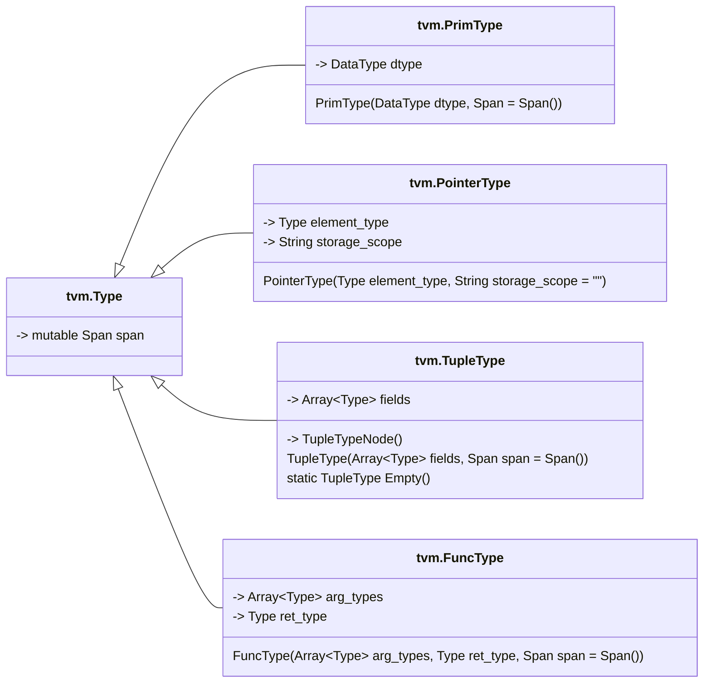

### 3. tvm::Range

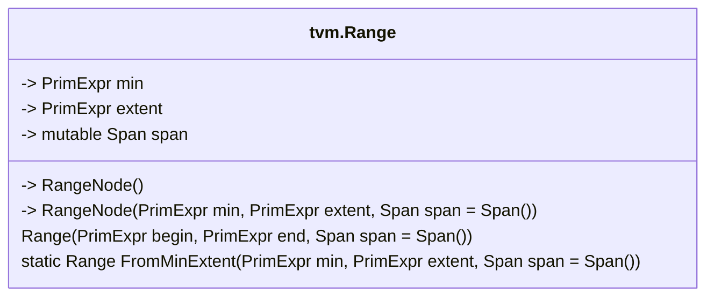

### 4. tvm::tir::IterVar

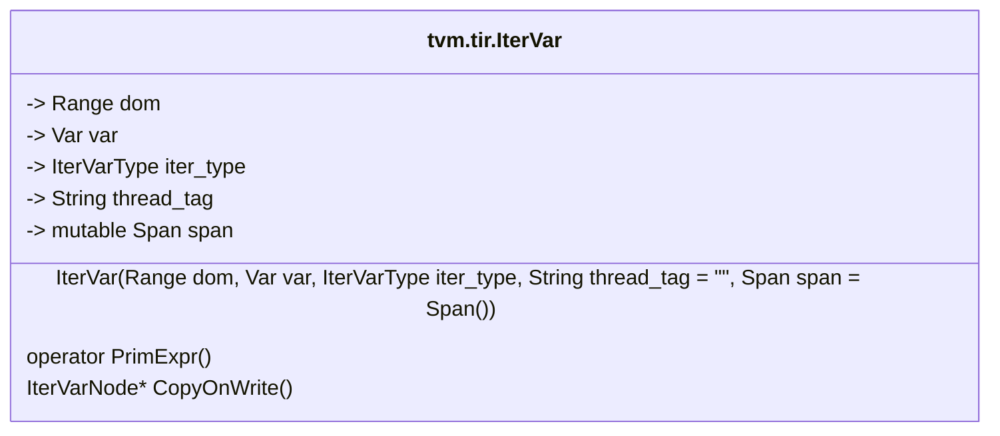

### 5. tvm::tir::CommReducer

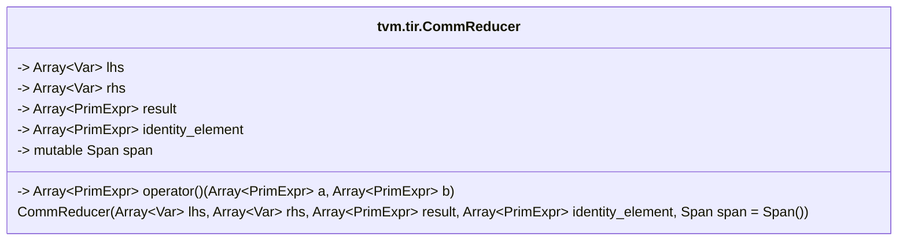

## Inheritance Diagram

### tvm::RelaxExpr

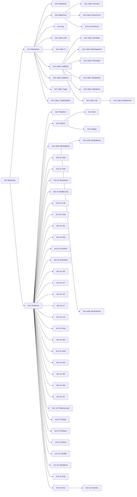

### tvm::Type

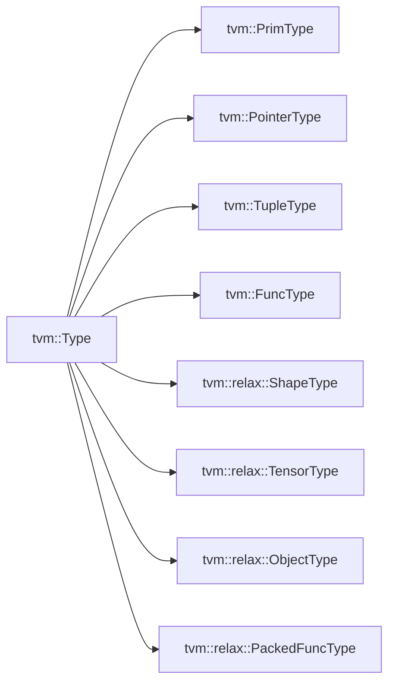

### tvm::transform::Pass

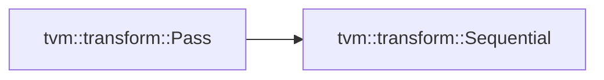

### tvm::tir::Stmt

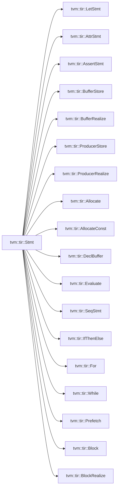

### tvm::te::Operation

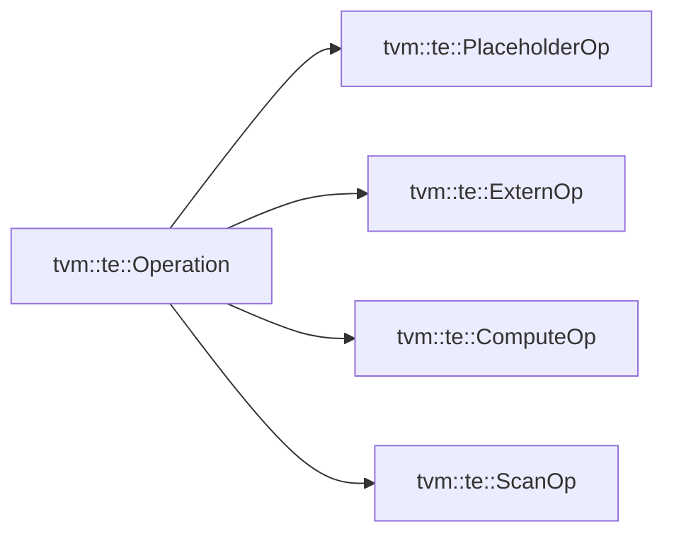

### tvm::tir::ExprFunctor\<FType\> & vm::tir::StmtFunctor\<FType\>

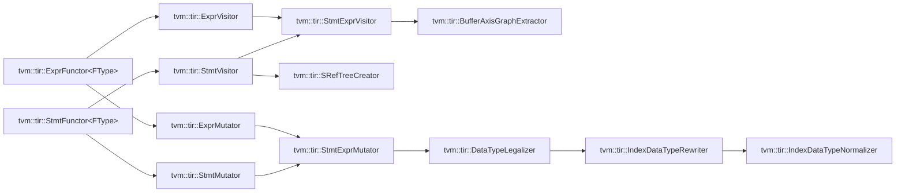

### tvm::GlobalInfo

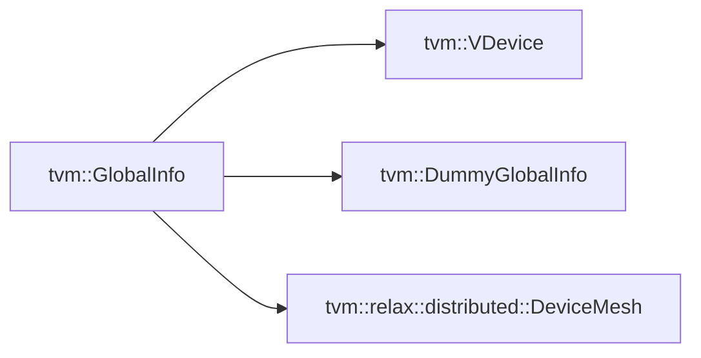

### tvm::Attrs

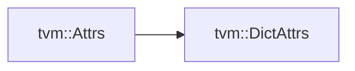

### tvm::PrimExprConvertible

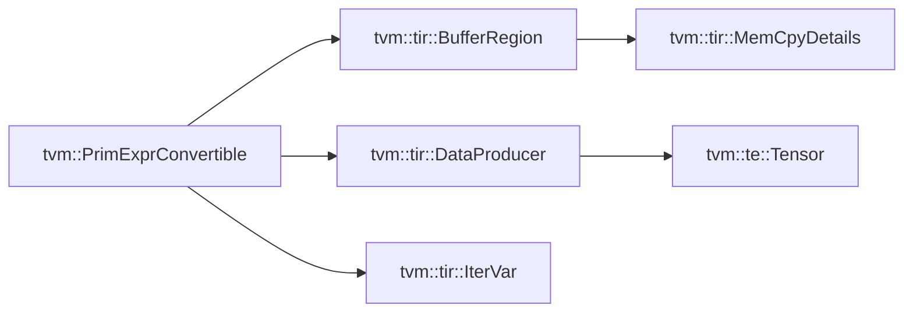

### tvm::Span


### tvm::ObjectPath

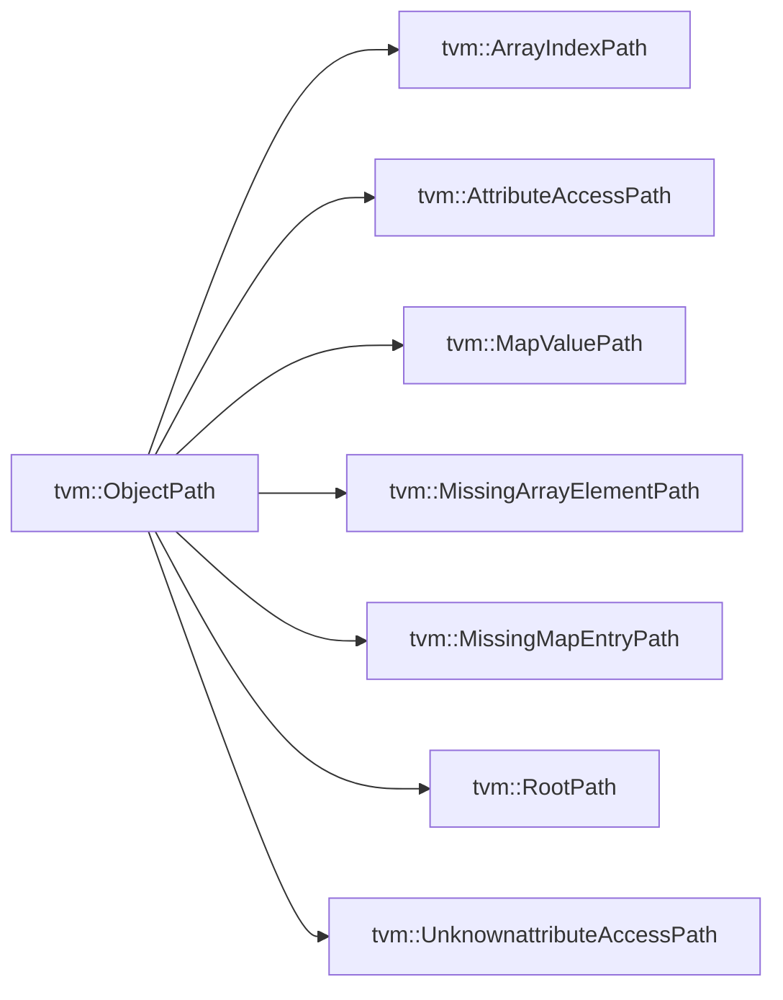

### tvm::BaseValueEqual

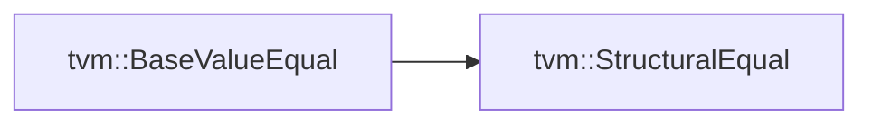

### tvm::SEqualReducer::Handler

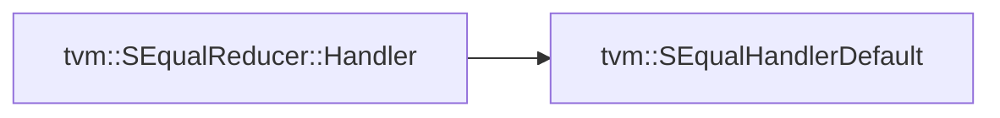

### tvm::BaseValueHash

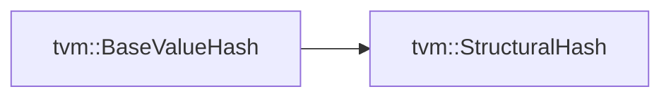

### tvm::SHashReducer::Handler

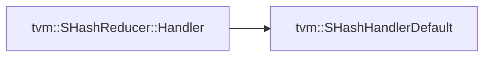

### tvm::AttrRegistryMap\<KeyType, ValueType\>

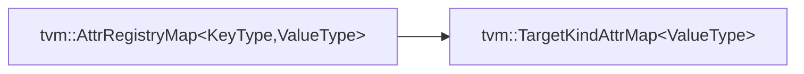

### tvm::tir::BlockScope

```mermaid
flowchart LR
    tvm::tir::BlockScope --> tvm::tir::BlockInfo
```

### Others

- Under namespace `tvm::script`
- Under namespace `tvm::relax`
- Under namespace `tvm::runtime`
- Under namespace `tvm::meta_schedule`
- Under namespace `tvm::ffi`
- Under namespace `tvm::detail`
- Under namespace `tvm::support`
