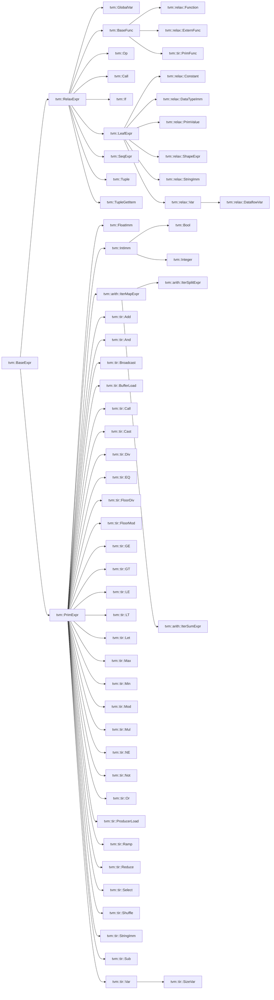
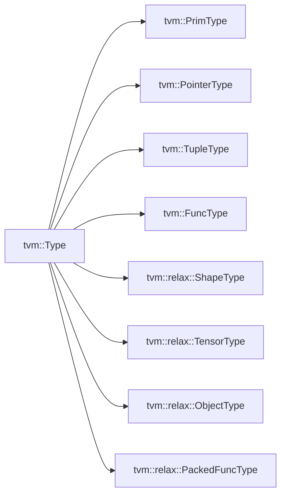
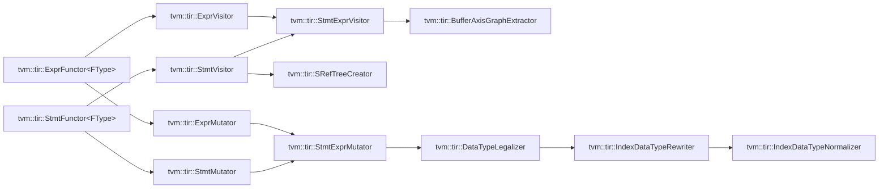
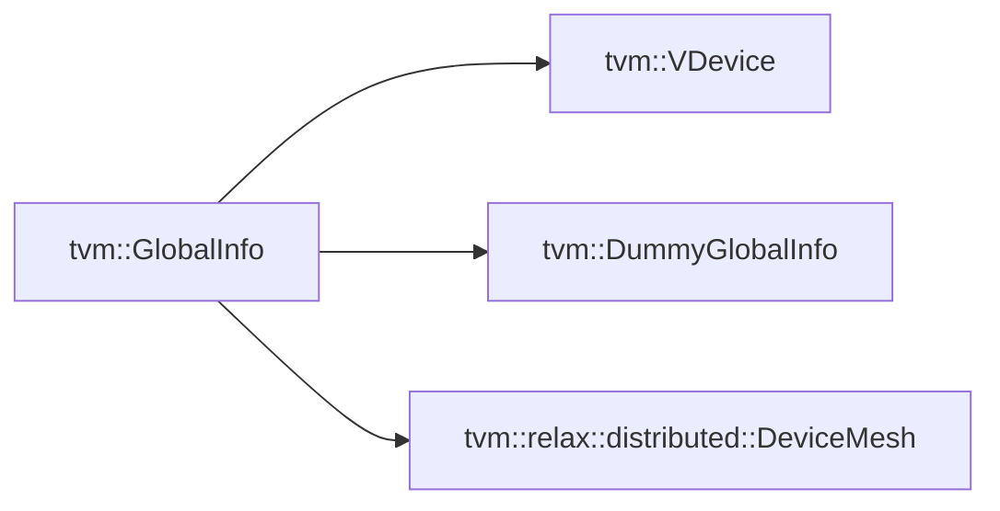
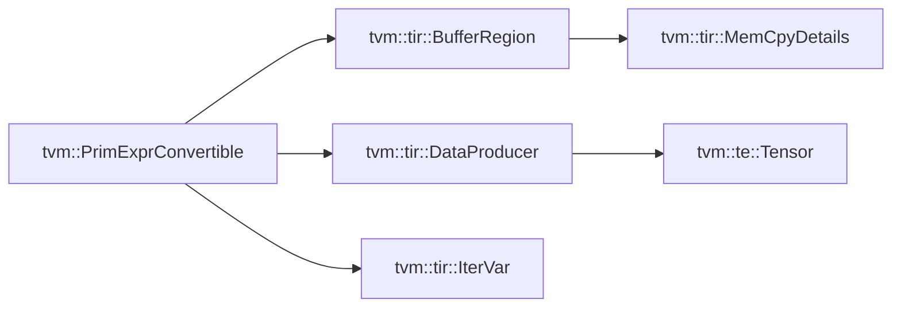
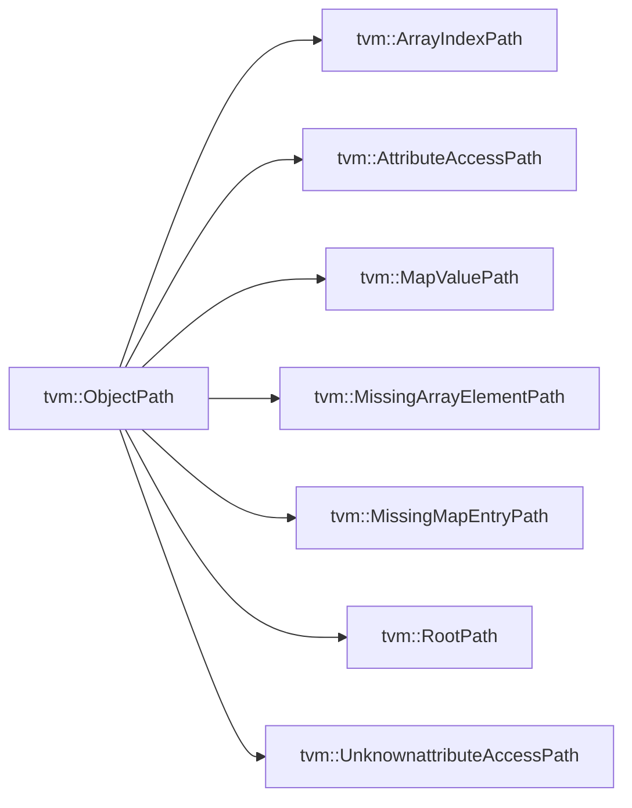
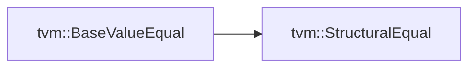
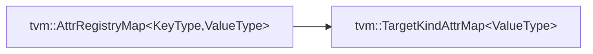

## Inheritance Diagram

### tvm::RelaxExpr

### tvm::Type

### tvm::transform::Pass

### tvm::tir::ExprFunctor\<FType\> & vm::tir::StmtFunctor\<FType\>

### tvm::GlobalInfo

### tvm::Attrs

### tvm::PrimExprConvertible

### tvm::Span

### tvm::ObjectPath

### tvm::BaseValueEqual

### tvm::SEqualReducer::Handler

### tvm::BaseValueHash

### tvm::SHashReducer::Handler

### tvm::AttrRegistryMap\<KeyType, ValueType\>

